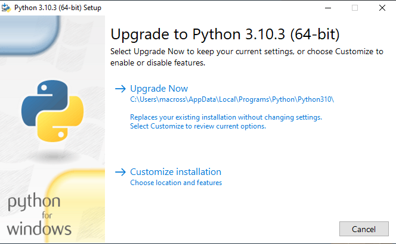
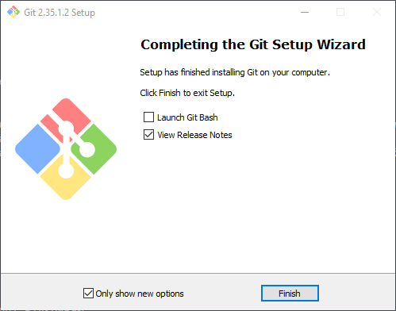
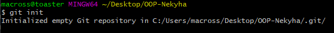
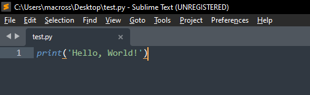
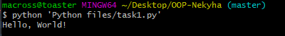

Львівський національний університет природокористування

Факультет механіки, енергетики та інформаційних технологій

Кафедра інформаційних технологій

Звіт з лабораторної роботи №1

на тему: 
 # Вступне заняття. Налаштування середовища розробки Python 3 і запуск програм

Виконав: студент групи ІТ-31 Некига М.І.

Перевірив: Татомир А. В.

**Мета роботи:** ознайомитися з інструментарієм розробки веб-додатків.

 ## Завдання
1. Навчитися встановлювати середовище розробки Python 3 в різних операційних системах і запускати програми.
2. Написати базову програму згідно виданого завдання та проаналізувати її роботу.
3. На прикладі написаної програми навчитися застосовувати систему Git для контролю версій  програмного забезпечення.

 ## Хід роботи
1. Встановлюю (оновлюю) Python 3.10.3.

2. Встановлюю Git.

3. Створюю папку з іменем OOP-Nekyha, у цій папці через контекстне меню відкриваю комндний рядок Git Bash.

4. Ініціалізую у папці репозиторій Git ввівши наступну команду:

        git init

5. В редакторі коду створюю новий файл та записую у нього код тестової програми. Зберігаю файл у папці "Python files" у директорії репозиторію.

6. Запускаю створений файл у командному рядку:

        python 'Python files/task1.py'

7. Зберігаю зміни в репозиторії. Для цього спочатку